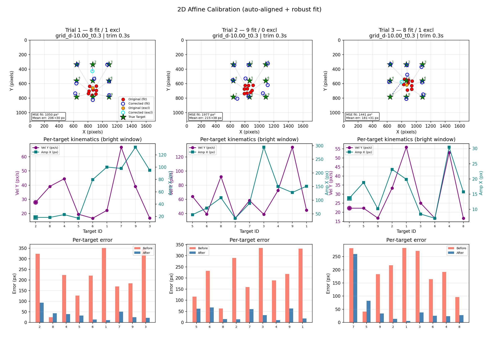

# Participant Calibration App

**NASA internship** · 9-point eye-tracker calibration + affine drift correction

PsychoPy presents known on-screen targets while Tobii records gaze. The backend aligns the two clocks, fits a robust **2D affine** map (observed → true pixels), and exports corrected gaze for analysis.

<p align="center">
  
</p>

<p align="center"><em>Demo results: mean calibration error ~200&nbsp;px → ~30&nbsp;px after correction</em></p>

---

## Why this exists

Raw Tobii coordinates are often **offset, scaled, or skewed** relative to the stimulus display. Without correction, screen-referenced analyses (AOIs, fixations) are unreliable.

This repo provides:

| Piece | Role |
|-------|------|
| **Frontend** | Fullscreen 9-point stimulus + VSYNC-timed ground-truth CSV |
| **Backend** | Clock alignment → robust affine fit → full-stream correction + QA plot |

The frontend does **not** talk to Tobii hardware. Record gaze separately, then run the backend offline.

---

## Pipeline

```text
┌─────────────────────┐     ┌──────────────────────────┐
│  Tobii eye tracker  │     │  Frontend (PsychoPy)     │
│  Continuous gaze    │     │  9-point calibration     │
│  Session clock ≈ 0  │     │  Unix VSYNC timestamps   │
└─────────┬───────────┘     └────────────┬─────────────┘
          │  gazedataN.csv               │  calibration_targetsN.csv
          └────────────────┬─────────────┘
                           ▼
                  ┌────────────────────┐
                  │  Backend engine    │
                  │  Align → Fit → Apply│
                  └─────────┬──────────┘
                            ▼
              *_corrected.csv  +  drift_correction_summary.png
```

---

## Repository layout

```text
ParticipantCalibrationApp-NASA/
├── README.md                         ← overview (this file)
├── Frontend/
│   ├── calibration_9point.py         ← PsychoPy 9-point app
│   ├── run.sh / run.ps1
│   ├── requirements.txt
│   ├── README.md                     ← frontend details
│   └── calibration_output/           ← target CSVs
└── Backend/
    ├── calibration_engine.py         ← affine correction
    ├── requirements.txt
    ├── README.md                     ← backend details
    └── data/
        ├── input/                    ← demo Tobii gaze
        └── output/                   ← corrected gaze + summary figure
```

---

## Quick start

### Requirements

- **Frontend:** Python **3.10**, OpenGL-capable monitor, PsychoPy  
- **Backend:** Python 3.10+ with `numpy`, `pandas`, `matplotlib`  
- Tobii (or compatible) gaze export for real sessions  

### 1 · Run calibration stimulus

```bash
cd Frontend
chmod +x run.sh   # first time only (macOS / Linux)
./run.sh
```

Windows:

```powershell
cd Frontend
.\run.ps1
```

Smoke test (no participant):

```bash
./run.sh --auto
```

Writes: `Frontend/calibration_output/calibration_targets_<UTC>.csv`

### 2 · Correct gaze (demo data included)

```bash
cd Backend
pip install -r requirements.txt
python calibration_engine.py
```

Writes to `Backend/data/output/`:

| Output | Description |
|--------|-------------|
| `gazedataN_corrected.csv` | Full gaze stream + `Corrected_Gaze_X/Y` (screen pixels) |
| `drift_correction_summary.png` | Spatial map, kinematics, and per-target error |

For a new session: place Tobii CSV as `data/input/gazedataN.csv` and matching targets as `Frontend/calibration_output/calibration_targetsN.csv`, then re-run the engine.

---

## Method (short)

1. Auto-align frontend Unix timestamps with Tobii session time  
2. Take **median** gaze in each bright-target window (after saccade trim)  
3. Fit a robust **2D affine** map; drop post-fit outliers  
4. Apply the map to **every** gaze sample in the trial  

Docs: [Frontend/README.md](Frontend/README.md) · [Backend/README.md](Backend/README.md)

---

## Demo results

On the included three trials, mean error on the fit set drops from roughly **180–215 px → 30–38 px**. Corrected points hug the true 9-point grid; per-target error bars shrink after correction.

---

## License / affiliation

Built for a **NASA internship** eye-tracking research workflow.  
Repository: [ParticipantCalibrationApp-NASA](https://github.com/amirkhabaza/ParticipantCalibrationApp-NASA)
