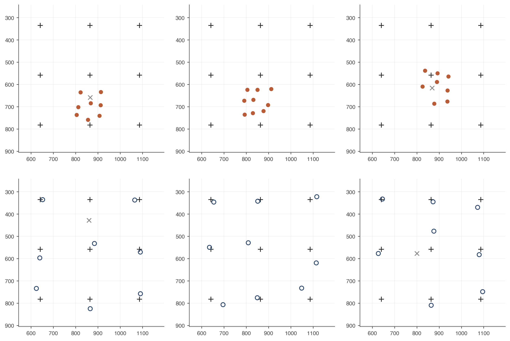
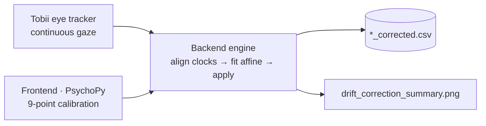

<div align="center">

# Participant Calibration App

**A 9-point eye-tracker calibration and affine drift-correction pipeline**

Built during a NASA internship · validated in a human-in-the-loop workload study

[](Frontend/requirements.txt)
[](Frontend/calibration_9point.py)
[](Backend/README.md)
[](LICENSE)
[](#validated-in-the-field-the-llatt-study)

</div>

PsychoPy presents known on-screen targets while a Tobii eye tracker records gaze. The backend aligns the two clocks, fits a robust **2D affine** map (observed → true pixels), and exports corrected gaze ready for analysis.

<p align="center">
  
</p>

<p align="center"><em>Demo results: mean calibration error ~200&nbsp;px → ~30&nbsp;px after correction</em></p>

---

## Contents

1. [Why this exists](#why-this-exists)
2. [Validated in the field: the LLATT study](#validated-in-the-field-the-llatt-study)
3. [Pipeline](#pipeline)
4. [Repository layout](#repository-layout)
5. [Quick start](#quick-start)
6. [Method (short)](#method-short)
7. [Demo results](#demo-results)
8. [License / affiliation](#license--affiliation)

---

## Why this exists

Raw Tobii coordinates are often **offset, scaled, or skewed** relative to the stimulus display. Without correction, screen-referenced analyses (AOIs, fixations, workload proxies) are unreliable.

This repo provides:

| Piece | Role |
|-------|------|
| **Frontend** | Fullscreen 9-point stimulus + VSYNC-timed ground-truth CSV |
| **Backend** | Clock alignment → robust affine fit → full-stream correction + QA plot |

The frontend does **not** talk to Tobii hardware directly. Record gaze separately, then run the backend offline.

---

## Validated in the field: the LLATT study

This pipeline was used as the eye-tracker calibration step for the **Lunar-Lander Analog Tracking Task (LLATT)** — a human-in-the-loop study assessing operator workload and performance during simulated pursuit tracking, comparing control power against maximum rate command.

| | |
|---|---|
| **Session length** | 75–90 minutes per participant |
| **Trial structure** | 27 primary trials + 5 training trials, arranged on a 3×3 tracking grid |
| **Cohort** | Target N = 9–18 adult operators; this pipeline calibrated and processed data for **12 participants** |
| **Hardware** | Tobii eye-tracking glasses |
| **What was measured** | Gaze telemetry (point of regard) and mean pupil diameter — a standard biometric proxy for cognitive workload |

Before analysis, raw glasses telemetry needs to be tied to real screen coordinates. This tool ran the 9-point calibration protocol for each participant and applied the affine correction so gaze and pupil data could be trusted as workload indicators for the tracking task — the same category of measurement used to study **pilot and astronaut workload** during manual control tasks.

---

## Pipeline


```mermaid
flowchart LR
    T[Tobii eye tracker<br/>continuous gaze] --> B
    F[Frontend · PsychoPy<br/>9-point calibration] --> B[Backend engine<br/>align clocks → fit affine → apply]
    B --> C[("*_corrected.csv")]
    B --> P[drift_correction_summary.png]
```

---

## Repository layout

```text
ParticipantCalibrationApp-NASA/
├── README.md                         ← overview (this file)
├── LICENSE                           ← MIT
├── Frontend/
│   ├── calibration_9point.py         ← PsychoPy 9-point app
│   ├── run.sh / run.ps1
│   ├── requirements.txt
│   ├── README.md                     ← frontend details
│   └── calibration_output/           ← target CSVs
└── Backend/
    ├── calibration_engine.py         ← affine correction
    ├── requirements.txt
    ├── README.md                     ← backend details
    └── data/
        ├── input/                    ← demo Tobii gaze
        └── output/                   ← corrected gaze + summary figure
```

---

## Quick start

### Requirements

- **Frontend:** Python **3.10**, OpenGL-capable monitor, PsychoPy
- **Backend:** Python 3.10+ with `numpy`, `pandas`, `matplotlib`
- Tobii (or compatible) gaze export for real sessions

### 1 · Run calibration stimulus

```bash
cd Frontend
chmod +x run.sh   # first time only (macOS / Linux)
./run.sh
```

Windows:

```powershell
cd Frontend
.\run.ps1
```

Smoke test (no participant):

```bash
./run.sh --auto
```

Writes: `Frontend/calibration_output/calibration_targets_<UTC>.csv`

### 2 · Correct gaze (demo data included)

```bash
cd Backend
pip install -r requirements.txt
python calibration_engine.py
```

Writes to `Backend/data/output/`:

| Output | Description |
|--------|-------------|
| `gazedataN_corrected.csv` | Full gaze stream + `Corrected_Gaze_X/Y` (screen pixels) |
| `drift_correction_summary.png` | Spatial map, kinematics, and per-target error |

For a new session: place Tobii CSV as `data/input/gazedataN.csv` and matching targets as `Frontend/calibration_output/calibration_targetsN.csv`, then re-run the engine.

---

## Method (short)

1. Auto-align frontend Unix timestamps with Tobii session time
2. Take **median** gaze in each bright-target window (after saccade trim)
3. Fit a robust **2D affine** map; drop post-fit outliers
4. Apply the map to **every** gaze sample in the trial

Docs: [Frontend/README.md](Frontend/README.md) · [Backend/README.md](Backend/README.md)

---

## Demo results

On the included three demo trials, mean error on the fit set drops from roughly **180–215 px → 30–38 px**. Corrected points hug the true 9-point grid; per-target error bars shrink after correction. The same correction approach was used to prepare gaze and pupil-diameter data for workload analysis in the [LLATT study](#validated-in-the-field-the-llatt-study) above.

---

## License / affiliation

MIT-licensed — see [LICENSE](LICENSE).

Built by [Amir Khabaza](https://github.com/amirkhabaza) during a NASA internship, for an eye-tracking research workflow. This is an independent personal project, not an official NASA software release, and does not imply NASA endorsement.

Repository: [ParticipantCalibrationApp-NASA](https://github.com/amirkhabaza/ParticipantCalibrationApp-NASA)
